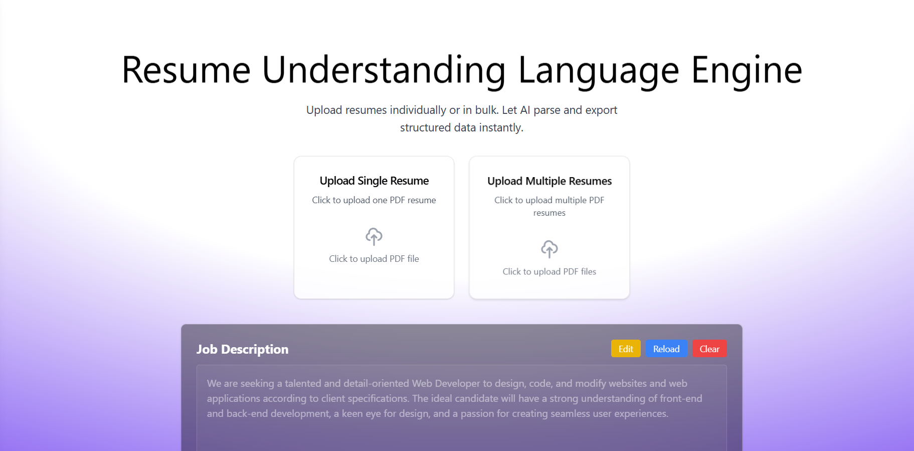

# Resume Understanding Language Engine (RULE)

**RULE**: AI-Powered Resume Parsing and Analysis Platform



<div align="center">

Upload resumes individually. Let AI parse and export structured data instantly.

[](https://choosealicense.com/licenses/mit/)
[](https://docker.com)
[](https://fastapi.tiangolo.com)
[](https://reactjs.org)

[📖 Documentation](https://rule-docs.onrender.com/) • [❓ FAQ](https://rule-docs.onrender.com/#faq) • [🚀 Quick Start](#quick-start)

</div>


Welcome to Resume Understanding Language Engine, a cutting-edge full-stack application that leverages AI to parse, analyze, and extract structured data from resumes instantly. Upload resumes individually or in bulk, and let our intelligent system provide comprehensive candidate analysis with eligibility assessments and detailed insights.

📖 **Documentation**: [Visit our comprehensive docs](https://rule-docs.onrender.com/)

🤔 **FAQ**: [Find answers to common questions](https://rule-docs.onrender.com/#faq)

<!-- 🎯 *Live Demo*: Experience the power of AI-driven resume analysis in action! -->

## Table of Contents
- [Features](#features)
- [Tech Stack](#tech-stack)
- [Quick Start](#quick-start)
- [Setup Options](#setup-options)
- [Docker Installation](#docker-installation)
- [Manual Installation](#manual-installation)
- [Configuration](#configuration)
- [API Documentation](#api-documentation)
- [Project Structure](#project-structure)
- [Available Scripts](#available-scripts)
- [Contributing](#contributing)
- [Troubleshooting](#troubleshooting)
- [FAQ](#faq)
- [Contributors](#contributors)
- [License](#license)

## Features

🤖 **AI-Powered Analysis**: Advanced LLM integration for intelligent resume parsing and candidate evaluation

📄 **Multi-Format Support**: Seamless processing of text-based and scanned PDF resumes using OCR technology

⚡ **Real-time Processing**: Instant resume analysis with structured data extraction

🎯 **Eligibility Assessment**: Smart candidate evaluation against job requirements with detailed feedback

📊 **Comprehensive Insights**: Extract candidate information, experience analysis, leadership assessment, and role fit analysis

📱 **Modern UI/UX**: Beautiful, responsive interface built with React, Tailwind CSS, and ShadCN UI

🚀 **Export Options**: Download analysis results in CSV or JSON formats

🐳 **Docker Ready**: Containerized application for easy deployment and development

🔧 **API-First Design**: RESTful API with comprehensive documentation

## Tech Stack

### Frontend
- **React 19** with TypeScript
- **Vite** for lightning-fast development
- **Tailwind CSS** for modern styling
- **ShadCN UI** for accessible components
- **Framer Motion** for smooth animations
- **Lucide Icons** for beautiful iconography

### Backend
- **FastAPI** for high-performance API
- **Python 3.10+** with modern async/await patterns
- **PDFPlumber** and **PyPDF** for text extraction
- **Tesseract OCR** for scanned document processing with image enhancement
- **spaCy NLP** for intelligent text processing and entity recognition

### Infrastructure
- **Docker** & **Docker Compose** for containerization
- **UV** for fast Python package management
- **CORS** enabled for cross-origin requests

## Quick Start

Get Resume Understanding Language Engine running on your machine in under 5 minutes!

### Prerequisites
- **Docker** and **Docker Compose** (Recommended)
- **Node.js 18+** (for manual setup)
- **Python 3.10+** (for manual setup)

### Option 1: Docker Setup (Recommended)

1. **Clone the repository**
   ```bash
   git clone https://github.com/MSG-Mutual-Support-to-Grow/rule
   cd rule
   ```

2. **Configure LLM settings** (Required)
   ```bash
   # Copy the example config file
   cp configs/llm_config_example.json configs/llm_config.json
   
   # Edit configs/llm_config.json with your preferred LLM provider settings in the frontend
   ```

3. **Start the application**
   ```bash
   docker-compose up --build
   ```

4. **Access the applications**
   - **Frontend**: http://localhost:5173
   - **Backend API**: http://localhost:8000
   - **API Documentation**: http://localhost:8000/docs

That's it! 🎉 Your Resume Understanding Language Engine platform is now running!

## Setup Options

### Docker Installation

#### Quick Commands
```bash
# Configure LLM first (required)
cp configs/llm_config_example.json configs/llm_config.json

# Start services
docker-compose up

# Start in background
docker-compose up -d

# Rebuild and start
docker-compose up --build

# Stop services
docker-compose down

# View logs
docker-compose logs -f

# View specific service logs
docker-compose logs -f backend
docker-compose logs -f frontend
```

#### Development Features
- **Hot Reload**: Changes to frontend/backend automatically reload
- **Volume Mounts**: Local development with instant updates
- **Isolated Environment**: No dependency conflicts

### Manual Installation

For detailed manual installation instructions, please refer to the specific component documentation:

#### Backend Setup
📖 **Detailed Backend Setup**: See [Backend README](backend/README.md) for comprehensive installation instructions including:
- System dependencies installation (Tesseract, Poppler, OpenCV)
- Python environment setup
- LLM configuration
- All available API endpoints

#### Frontend Setup  
📖 **Detailed Frontend Setup**: See [Frontend README](frontend/README.md) for complete frontend setup including:
- Node.js and npm setup
- Development server configuration
- Build and deployment instructions
- UI component documentation

#### Quick Setup Summary
If you prefer manual setup over Docker:

1. **Backend**: 
   ```bash
   cd backend
   # Follow detailed instructions in backend/README.md
   uvicorn api.main:app --host 0.0.0.0 --port 8000 --reload
   ```

2. **Frontend**:
   ```bash
   cd frontend  
   # Follow detailed instructions in frontend/README.md
   npm install && npm run dev
   ```

## Configuration

### LLM Configuration
📖 **Detailed LLM Setup**: For comprehensive LLM configuration including Ollama setup, model selection, and provider switching, see [Backend README](backend/README.md#-configuration).

### Quick LLM Setup
```bash
# Copy the example config file
cp configs/llm_config_example.json configs/llm_config.json

# Edit configs/llm_config.json with your preferred settings
# - For Ollama (local): Set provider to "ollama" 
# - For OpenRouter (cloud): Set provider to "openrouter" and add API key
```

## API Documentation

📖 **Complete API Documentation**: For detailed API endpoint documentation with request/response examples, see [Backend README](backend/README.md#-detailed-api-endpoints).

### Quick API Reference

#### Upload Resume
```http
POST /api/upload-resume/
Content-Type: multipart/form-data

Parameters:
- file: PDF file (required)

Response:
{
  "success": true,
  "resume_id": "uuid",
  "full_name": "John Doe",
  "fit_score": 8,
  "eligibility_status": "Eligible",
  "skills": {...},
  "experience_analysis": {...}
}
```

#### Available Endpoints
- **Resume Processing**: Upload single/batch resumes for analysis
- **Job Management**: Save and retrieve job descriptions  
- **LLM Configuration**: Manage AI providers and settings
- **Analysis Retrieval**: Get detailed candidate analysis results

📋 **Interactive API Docs**: http://localhost:8000/docs (when running)


## Project Structure

```
rule/
├── 📁 backend/
│   ├── 📁 api/
│   │   ├── en_core_web_sm-3.7.1-py3-none-any.whl   # SpaCy model wheel
│   │   └── main.py                                 # FastAPI entrypoint
│   ├── 📁 modules/
│   │   ├── 📁 llm/
│   │   │   ├── 📁 handlers/
│   │   │   │   ├── ollama_handler.py               # Local model handler
│   │   │   │   ├── openrouter_handler.py           # Cloud model handler
│   │   │   │   └── __init__.py
│   │   │   ├── base_provider.py                    # Abstract class for LLMs
│   │   │   ├── llm_automation.py                   # Main logic pipeline
│   │   │   ├── provider_router.py                  # Dynamic model switcher
│   │   │   └── utils.py                            # Shared utilities
│   │   ├── 📁 llm_prompts/
│   │   │   └── parse_resume_llm.py                 # Prompt engineering for resumes
│   │   └── 📁 text_extract/
│   │       ├── extract_native_pdf.py               # Native PDF extractor
│   │       └── extract_ocr_pdf.py                  # OCR-based PDF extractor
│   ├── 📁 pipelines/
│   │   └── analyze_resume.py                       # Combined processing pipeline
│   ├── ENHANCED_BACKEND_API.md                     # API usage guide
│   ├── QUICK_REFERENCE.md                          # Developer quick start
│   ├── README.md                                   # Backend README
│   └── requirements-dev.txt                        # Backend dependencies
│
├── 📁 docs/images/
│   └── Landing_Page.png                            # Screenshot of landing page
│
├── 📁 frontend/
│   ├── 📁 public/
│   └── 📁 src/
│       ├── 📁 assets/
│       │   └── react.svg
│       ├── 📁 blocks/
│       │   └── BlurText.tsx                        # Obfuscated output preview
│       ├── 📁 components/
│       │   ├── 📁 layout/
│       │   │   ├── Sidebar.tsx                     # Sidebar nav
│       │   │   ├── UploadCard.tsx                  # Upload UI
│       │   │   └── OutputViewer.tsx                # JSON/text output UI
│       │   └── 📁 ui/                               # Reusable UI elements
│       ├── 📁 const/
│       │   └── mockdata.ts                         # Demo/mock data
│       ├── 📁 lib/
│       │   ├── api.ts                              # Axios API hooks
│       │   └── utils.ts                            # Frontend helpers
│       ├── 📁 pages/
│       │   └── LandingPage.tsx                     # Main landing page
│       ├── App.css
│       ├── App.tsx                                 # Root App component
│       ├── index.css
│       ├── main.tsx                                # Entry point
│       └── vite-env.d.ts
│
├── .env                                            # Environment variables
├── .gitignore
├── components.json
├── docker-compose.yml                              # Combined Docker setup
├── Dockerfile.backend
├── Dockerfile.frontend
├── eslint.config.js
├── LICENSE
├── pyproject.toml                                  # Python backend config
├── README.md                                       # Root README
├── requirements.txt                                # Default requirements

```


## Available Scripts

📖 **Detailed Scripts**: For comprehensive script documentation, see component-specific README files:
- **Backend Scripts**: [Backend README](backend/README.md#-testing)
- **Frontend Scripts**: [Frontend README](frontend/README.md)

### Quick Reference

#### Frontend Scripts
```bash
npm run dev          # Start development server
npm run build        # Build for production
npm run preview      # Preview production build
npm run lint         # Run ESLint
```

#### Backend Scripts  
```bash
uvicorn api.main:app --reload --host 0.0.0.0 --port 8000    # Development server
```

#### Docker Scripts
```bash
docker-compose up --build         # Build and start all services
docker-compose down               # Stop all services
docker-compose logs -f backend    # View backend logs
docker-compose logs -f frontend   # View frontend logs
```


## Contributing

We welcome contributions to Resume Understanding Language Engine! Here's how to get started:

### Development Workflow
1. **Fork the repository**
2. **Create a feature branch**
   ```bash
   git checkout -b feature/amazing-feature
   ```
3. **Make your changes**
4. **Run tests** (when available)
5. **Commit your changes**
   ```bash
   git commit -m "Add amazing feature"
   ```
6. **Push to your branch**
   ```bash
   git push origin feature/amazing-feature
   ```
7. **Open a Pull Request**

### Code Standards
- **Frontend**: ESLint configuration with React/TypeScript best practices
- **Backend**: Black formatting with isort import sorting
- **Commits**: Conventional commit messages preferred

### Development Guidelines
- Follow existing code structure and patterns
- Add comments for complex logic
- Update documentation for new features
- Test your changes thoroughly

## Troubleshooting

📖 **Detailed Troubleshooting**: For comprehensive troubleshooting guides, see [Backend README](backend/README.md#-troubleshooting).

### Quick Fixes

#### Configuration Issues
**Problem**: Application won't start or LLM errors
**Solution**:
```bash
# Ensure config file exists
cp configs/llm_config_example.json configs/llm_config.json

# Edit configs/llm_config.json with valid settings
```

#### Port Conflicts
**Problem**: Port 5173 or 8000 already in use
**Solution**: 
```bash
# Kill processes using the ports
lsof -ti:5173 | xargs kill -9
lsof -ti:8000 | xargs kill -9

# Or change ports in docker-compose.yml
```

#### Docker Build Failures
**Problem**: Docker build fails
**Solution**:
```bash
# Clear Docker cache
docker system prune -a

# Rebuild without cache
docker-compose build --no-cache
```


### Getting Help
- 📚 **Documentation**: [https://rule-docs.onrender.com/](https://rule-docs.onrender.com/)
- ❓ **FAQ**: [https://rule-docs.onrender.com/#faq](https://rule-docs.onrender.com/#faq)
- 🐛 **Issues**: Open a GitHub issue with detailed description

## FAQ

### 📁 General Questions

**Q: What file formats are supported?**  
A: Currently, only PDF files are supported. The system handles both text-based PDFs and scanned documents using OCR.

**Q: Is there a file size limit?**  
A: The default limit is 10MB per file. This can be configured in the FastAPI settings.

**Q: Can I process multiple resumes at once?**  
A: Yes. Bulk upload and processing has now been implemented with progress tracking.

**Q: Can I export the results?**  
A: Yes, exports are available in CSV and JSON formats.

---

### ⚙️ Technical Questions

**Q: Which AI models are used for analysis?**  
A: Currently, the app uses OpenRouter's Mistral API. You can also configure OpenAI, Anthropic, Groq, and others for local or cloud-based inference.

**Q: How accurate is the OCR for scanned documents?**  
A: The system uses Tesseract OCR with image enhancement, which provides good accuracy depending on the quality of the scanned document. The system also includes intelligent text cleaning and spell checking for better results.

**Q: Can I customize the analysis criteria?**  
A: Yes. Modify the LLM prompts in `backend/modules/llm_prompts/parse_resume_llm.py` to change evaluation logic for different job roles.

**Q: How is job eligibility determined?**  
A: Based on matching extracted skills, leadership experience, and years of experience against job profile templates.

**Q: Is multi-language resume support available?**  
A: Currently, the system primarily supports English. Multi-language support may depend on OCR and LLM capabilities configured.

---

### 🚀 Deployment Questions

**Q: How do I deploy this to production?**  
A: Use the included `Dockerfile` and `docker-compose.yml`. You can host it on AWS EC2, Azure, or GCP with proper environment variables and volume configurations.

**Q: Is the application secure?**  
A: Basic protections like CORS and validation are included. For production, enable HTTPS, add authentication, and limit API rate usage.

**Q: Can I run this without Docker?**  
A: Yes. Install dependencies using `pip` and `npm`, then run the backend and frontend servers separately.

**Q: Does it work offline?**  
A: Mostly yes — if you’re using local LLMs and have OCR libraries installed. However, online inference APIs (e.g., OpenRouter) require internet access.

## Roadmap

### Current Features ✅
- PDF resume upload and processing
- Text extraction from native and scanned PDFs
- AI-powered candidate analysis
- Eligibility assessment based on job requirements
- Experience and leadership evaluation
- Skills extraction and categorization
- Modern React frontend with responsive design
- RESTful API with documentation
- Docker containerization (backend + frontend)
- Export functionality (CSV/JSON)
- **Bulk Processing**: Upload and process multiple resumes with progress tracking
- **Advanced Analytics**: Compare, rank, and filter candidates based on extracted data
- **Custom Job Profiles**: Define and apply evaluation criteria tailored to different job roles
- **Multi-LLM Support**: Use multiple LLM providers (OpenAI, Anthropic, Groq, etc.) with configurable API keys for local or cloud processing


### 🙌 Contributors

- [@dharshan-kumarj](https://github.com/dharshan-kumarj)  
- [@ronnie-allen](https://github.com/ronnie-allen)  
- [@Aparna0224](https://github.com/Aparna0224)  
- [@Franz-kingstein](https://github.com/Franz-kingstein)  
- [@Danishprabhu04](https://github.com/Danishprabhu04)  
- [@BaluK345](https://github.com/BaluK345)  
- [@ThirupathiS-45](https://github.com/ThirupathiS-45)


## License

This project is licensed under the **MIT License**. See the [LICENSE](LICENSE) file for details.

### MIT License Summary
- ✅ Commercial use
- ✅ Modification
- ✅ Distribution
- ✅ Private use
- ❌ Liability
- ❌ Warranty

---

## Support

### Get Help
- 📖 **Documentation**: [https://rule-docs.onrender.com/](https://rule-docs.onrender.com/)
- ❓ **FAQ**: [https://rule-docs.onrender.com/#faq](https://rule-docs.onrender.com/#faq)
- 🐛 **Bug Reports**: [Open an issue](https://github.com/MSG-Mutual-Support-to-Grow/rule/issues)

---

**Developed with ❤ by MSG - (Mutual Support to Grow) community**

Transform your hiring process with AI-powered resume analysis!
